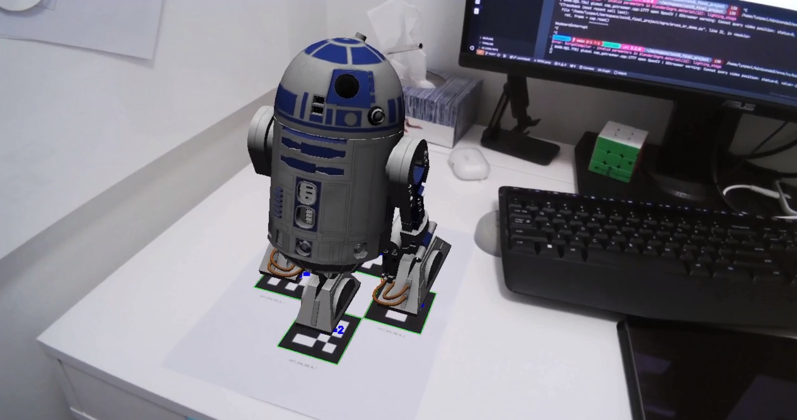

## CS445 AR 3DGS

### Getting started

1. Blender 4.2+, plugins, dependencies
This project requires [Blender](https://www.blender.org/download/releases/4-2/) to load the point clouds trained on Nerfstudio. You will also need [3DGS Render Blender Addon by KIRI Engine](https://github.com/Kiri-Innovation/3dgs-render-blender-addon) to display the Gaussian Splat point clouds with proper rendering in Blender. To run AuUco code detection and perform linear algebra computation on Blender's Python console, you need to install `opencv-contrib-python` and `numpy` in Blender's local Python site packages.

2. Nerfstudio
To train the 3DGS point clouds, we utilized the open-source platform [Nerfstudio](https://docs.nerf.studio/index.html) and their [Gaussian Splatting Implementation](https://docs.nerf.studio/nerfology/methods/splat.html).

3. Install the opencv-contrib-python with OVIS support (optional)
The pre-built release from pip did not include OVIS and OGRE support. If you want to run the script `ArVideoOverlay.py` that overlays the 3D mesh using `CV.OVIS` library, you can install the opencv wheel manually built by me for this project.
```
pip3 install opencv_wheels/opencv_contrib_python-4.11.0.86-cp312-cp312-linux_x86_64.whl
```

### Run
1. Data collection and training
Print out the designed AR Marker `DICT_4X4_250_id_0123.pdf` and place it at your target location. Take a video of your targeted real scene with multiple perspectives and enough duration on each perspective to ensure a detailed training result. Extract the video frame into static images and train the 3DGS point cloud with Nerfstudio using the `splatfacto` method. Export the final result as a `.ply` file.

2. Using Blender to process point cloud
Please refer to this [tutorial](https://www.youtube.com/watch?v=WUL73wQDtcE) on how to load the `.ply` point cloud with the KIRI addon. In addition to the point cloud, load the mesh you want to overlay on top of the AR code and rename it `mesh`. We used the R2D2 file downloaded from Sketchfab as an example here. You may need to adjust the scale and output rotation offset to best fit your targeted mesh.

Select an active camera viewpoint where we can observe the AR code clearly. Update the camera view pose of the `BlenderAR.py`, then run the script using the Python script editor in Blender. It may take a few seconds to process the script. After that, you should see the mesh object relocated to align with the AR code pose.

### Result
We first demonstrate the AR overlay algorithm in real time using a webcam stream. However, it is a 2D rendering overlay without the 3D model of the actual scene.


We then obtain the 3D model of the real scene using the 3DGS technique. Based on the workflow we did on video overlay, we automatically identify the scene's AR code. The AR code pose with respect to Blender's active camera is estimated, and we can relocate our synthetic object on the scene and align it with our target pose.

